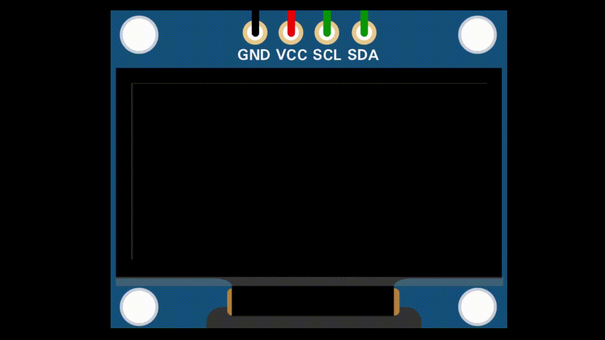
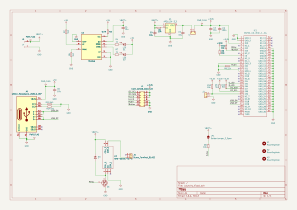
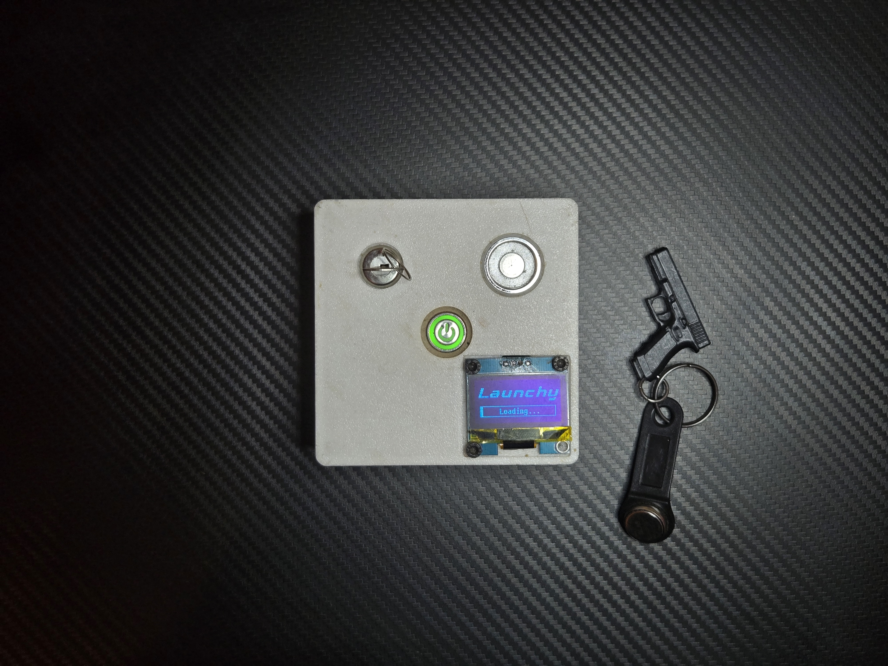
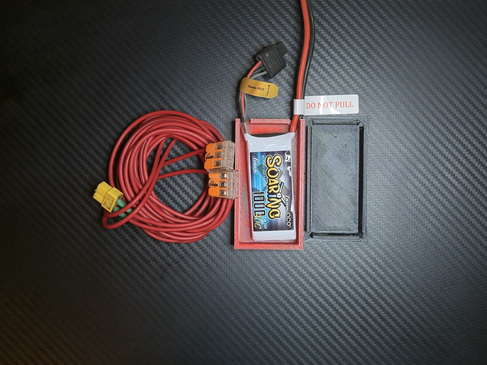

### ESP32 ESP-NOW Based model rocket launch controller

## 🤌Features

- ESP-NOW Long range protocol
- Multi-layer safety: Key switch, iButton, push button
- OLED display for status feedback
- Built in battery charging circuit (TP4056)
- USB-C for programming/charging
- Internal 1S / External 2S battery selection for the e-match
- Continuity test (1S mode)
- Preheat mode(1S mode)
- Configurabe Countdown time, Ignition time
## 🔧Hardware

&nbsp;&nbsp;&nbsp;&nbsp;&nbsp;The system is based on a custom PCB designed in KiCad, built around the ESP32-C3-MINI-1 module. Both the transmitter and the igniter/receiver use the same board design, but are populated with different component sets depending on their role. The
hardware integrates Li-Ion charging (TP4056), a 3.3 V LDO regulator (AP2112K), a MOSFET-driven relay interface, iButton authentication, and status LEDs. USB-C is provided for charging and programming, while screw terminals allow safe connection of the igniter circuit.

&nbsp;&nbsp;&nbsp;&nbsp;&nbsp;Complete manufacturing files are available as a ZIP inside the GERBER folder as well as the BoM. Symbol and footprint libraries are uploaded so the project should be fully editable in KiCad now.

## 💻Firmware
### Transmitter.ino
- Handles the remote unit (user interface + iButton authentication).
- Implements menus for:
    - Battery type selection
    - Continuity check
    - Countdown time
    - Preheat start time
    - Preheat duration
    - Ignition delta
- Uses ESP-NOW to send launch and continuity test commands
- Provides OLED display feedback via LaunchDisplayLibrary
- Requires valid iButton for arming and launch
### Receiver.ino
- Handles the receiver unit (relay + buzzer)
- Waits for commands over ESP-NOW
- Performs continuity test by measuring Vdrop
- Executes countdown, preheat, and ignition relay control
- Includes buzzer startup sounds and launch feedback
### LaunchDisplayLibrary
- Custom display driver using U8g2 for SH1106 OLED.
- Provides functions for:
    - Splash/welcome screen
    - Authentication animations
    - Armed state screen (with T-, P_s, P_d, I_d values)
    - Countdown + preheat visual feedback
    - Ignition screen
    - Menus for parameter selection
### GetMacAddress.ino
- Utility to print the ESP32’s MAC address (used for setting ESP-NOW peers).
### ReadFob.ino
- Utility to read and print iButton IDs (used to whitelist authorized keys).
### Dependencies
#### [Arduino Core for ESP32](https://github.com/espressif/arduino-esp32)
### Libraries:
- esp_now.h (built-in)
- WiFi.h (built-in)
- esp_wifi.h (for long-range protocol mode)
- OneWire (for iButton reader)
- U8g2lib (for OLED display)
## 🚀 Setup & Upload
1. Clone repo and open in Arduino IDE.
2. Select ESP32 Dev Module (or your ESP32 board).
3. Upload separately:
    - Transmitter.ino → Remote unit
    - 2.Receiver.ino → Receiver unit
4. Use GetMacAddress.ino on each ESP32 to note their MAC addresses.
    - Update broadcastAddress[] in transmitter/receiver code accordingly.
5. Use Read_fob.ino to read your iButton ID.
    - Replace in allowedID[] array in the transmitter code.
## 📺 Display demo

## 🔒 Safety

- Relay will not activate without valid iButton authentication.
- Launch packets use a session_id to prevent accidental re-triggering.
- Continuity test ensures igniter is properly connected before launch, if fails the system enters failsafe, requires full restart
## ✏️Schematic

## 📷Images

### Transmitter

### Igniter

### Accessories

## 🎥Demo

